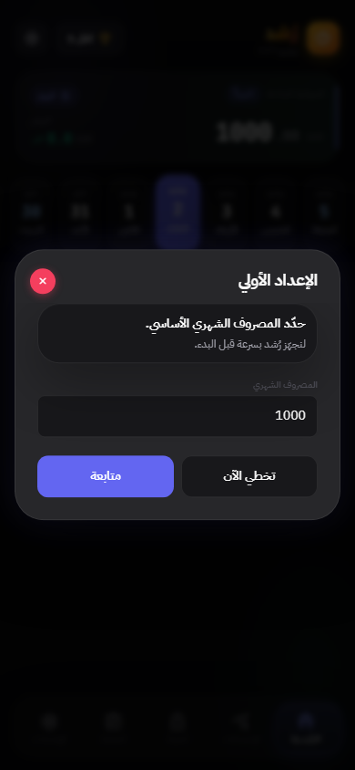
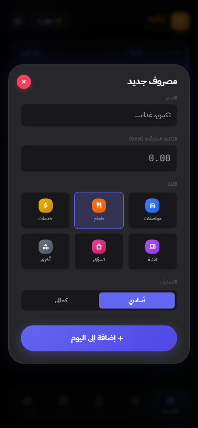
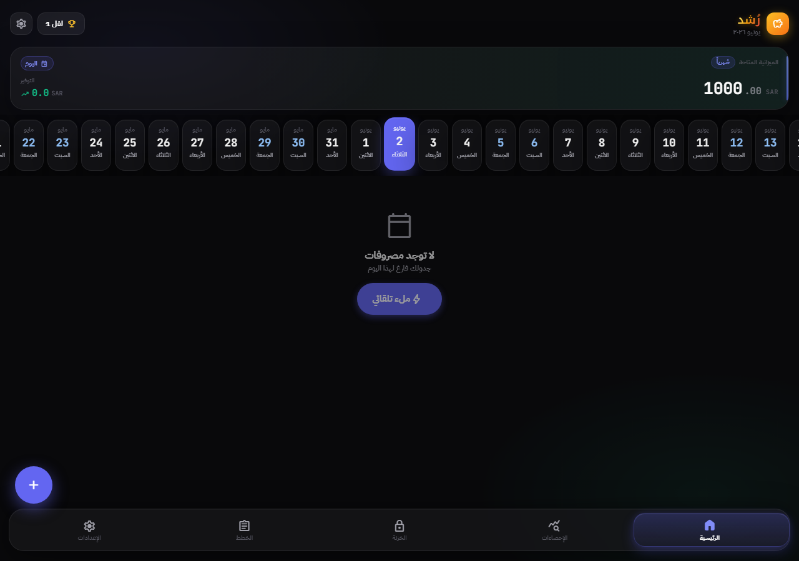
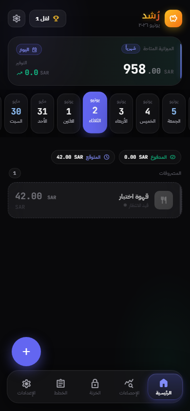

# Rushd / رُشد

Arabic-first personal finance assistant for tracking expenses, budgets, goals, and spending insights.

Rushd is a static web app for students and regular users who want a simple way to understand where their money goes, especially in an Arabic RTL interface with Saudi riyal amounts. It is an active prototype and should not be treated as financial advice.

## What It Does

- Tracks planned and paid expenses with categories, expected cost, actual paid amount, and essential/luxury classification.
- Shows a dashboard for the selected day, plus monthly statistics, category summaries, weekly spending, and safe-to-spend calculations.
- Supports recurring plan templates for workdays, offdays, monthly items, and flexible expenses.
- Includes savings vault goals, month-end surplus handling, and a short vault timeline.
- Stores user data in the browser using IndexedDB, with small UI preferences in localStorage.
- Supports Arabic-first RTL UI, English language mode, Gregorian/Hijri display setting, dark/light themes, motion settings, and SAR-focused formatting.
- Includes export/import backup and factory reset actions.

## Tech Stack

Rushd is currently a single-file static app:

- HTML
- CSS with Tailwind CDN utilities
- JavaScript
- Vue 3 from CDN
- IndexedDB for app data
- localStorage for preferences and deferred prompts

No server, cloud database, authentication, or model integration is implemented in this version. Assistant-like guidance is rule-based UI logic.

## Screenshots

These screenshots are captured from the current local app with default local data.









## Run Locally

Open `index.html` directly in a browser, or serve the folder locally:

```bash
python -m http.server 8000
```

Then open `http://localhost:8000`.

Optional checks:

```bash
npm test
```

The current test command checks repository structure, key app markers, and extracted finance-rule examples.

Optional browser smoke test:

```bash
npm install
npm run test:browser
```

The browser smoke test serves the static app locally, adds a fake expense, verifies it persists after refresh, and refreshes `docs/assets/screenshots/dashboard-with-expense.png`.

## Deployment

The app is prepared for static hosting. GitHub Pages can serve `index.html` from the repository root once Pages is enabled for the repository. A Pages workflow can be added later by a token/user with GitHub `workflow` permission.

## Privacy Notes

Rushd stores financial entries locally in the user's browser. It does not send data to a server in the current version. Clearing browser data, switching browsers, or using a different device can remove local data unless the user exports a backup first.

Users should avoid entering sensitive real financial data unless they understand the local storage model and have reviewed the code. See `docs/privacy-notes.md`.

## Project Status

Active prototype / in development. The current priority is making the single-file app easier to review, test, document, and eventually refactor safely.

## Roadmap

See `docs/roadmap.md` for the maintained roadmap. Near-term priorities include better QA coverage, screenshots, accessibility review, budget calculation tests, mobile polish, and clearer backup/restore validation.

## Contributing

See `CONTRIBUTING.md`. Please do not include real financial data, private screenshots, secrets, or personal records in issues or pull requests.

## License

MIT License. See `LICENSE`.
